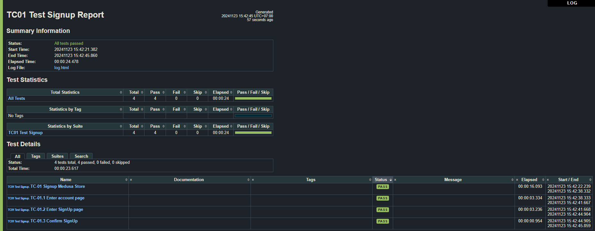
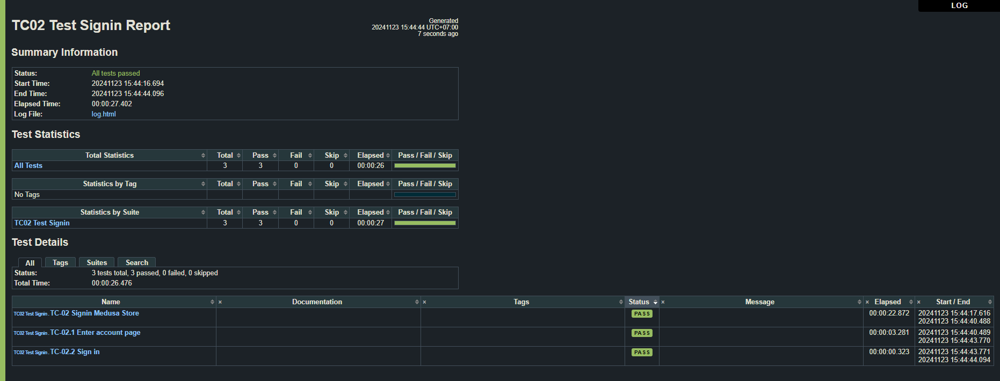
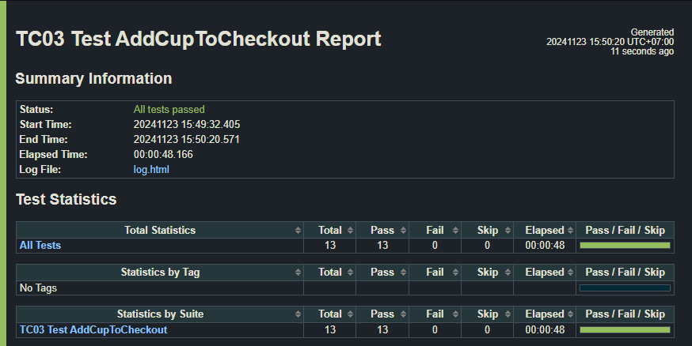
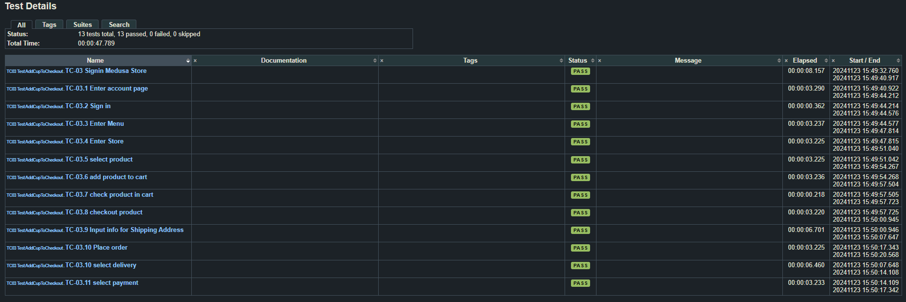
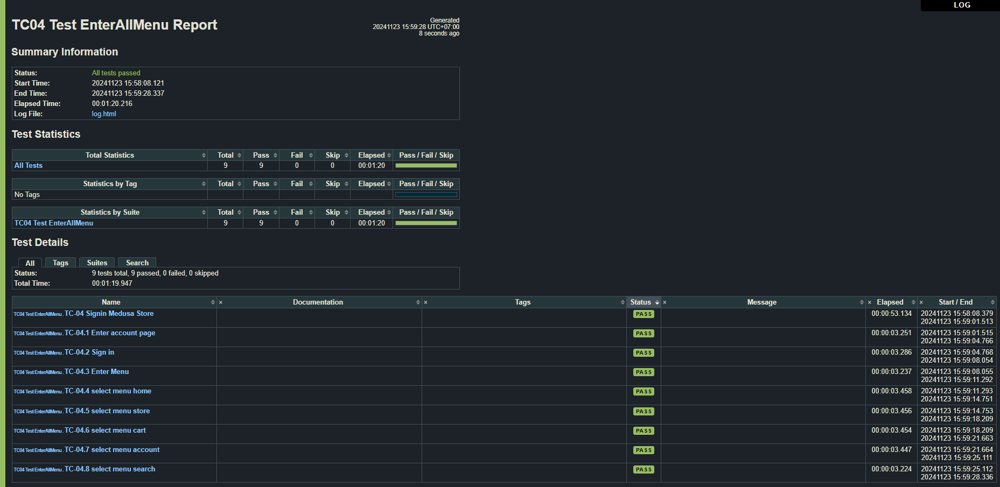
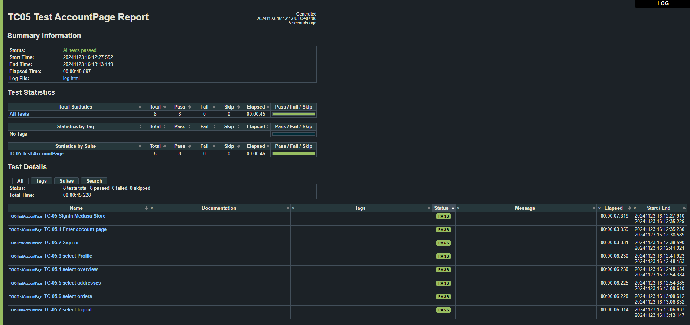
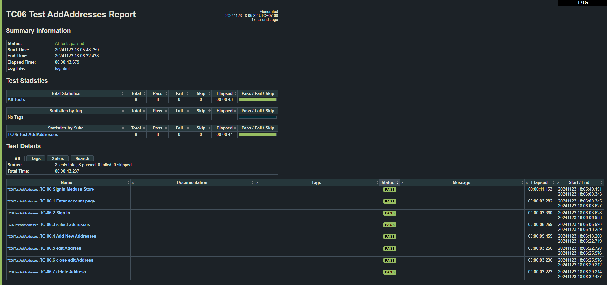
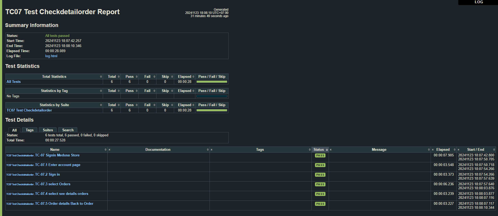
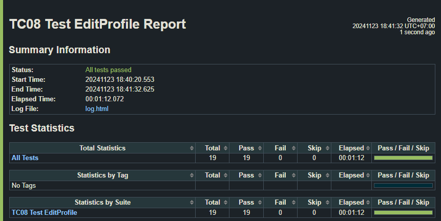
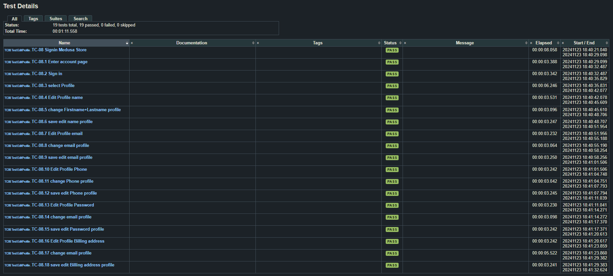

### Automated UI Testing

---

# TC01_Test_Signup.robot

เป้าหมาย: ทดสอบการสมัครบัญชีใหม่บนเว็บไซต์ "Medusa Store"

ขั้นตอนการทดสอบ: 

1.เปิดหน้าเว็บ Medusa Store 

2.เข้าสู่หน้าจัดการบัญชีผู้ใช้งาน 

3.เข้าหน้าสมัครบัญชี 

4.กรอกข้อมูล 

5.กดปุ่ม "ยืนยัน" เพื่อสมัครบัญชี

---

# TC02_Test_Signin.robot

เป้าหมาย: ทดสอบการเข้าสู่ระบบของสมาชิกบนเว็บไซต์ "Medusa Store"

ขั้นตอนการทดสอบ: 

1.เปิดหน้าเว็บ Medusa Store 

2.เข้าสู่หน้าจัดการบัญชีผู้ใช้งาน 

3.กรอกข้อมูลเข้าสู่ระบบ 

4.กดปุ่ม "Sign In" เพื่อเข้าสู่ระบบ

---

# TC03_Test_AddCupToCheckout.robot

เป้าหมาย: ทดสอบการเพิ่มสินค้าลงในตะกร้าสินค้าและดำเนินการสั่งซื้อสินค้าบนเว็บไซต์ "Medusa Store"

ขั้นตอนการทดสอบ: 

1.เข้าสู่ระบบ Medusa Store 

2.เข้าสู่หน้ารายการเมนูสินค้า (Menu Page) 

3.เข้าสู่หน้าร้านค้า (Store Page) 

4.เลือกสินค้า 

5.เพิ่มสินค้าเข้าสู่ตะกร้าสินค้า 

6.ตรวจสอบว่าสินค้าที่เลือกปรากฏในตะกร้าสินค้า 

7.กดปุ่ม "Checkout" เพื่อนำสินค้าในตะกร้าสินค้าเข้าสู่ขั้นตอนการชำระเงิน 

8.กรอกข้อมูลที่อยู่สำหรับจัดส่งสินค้า 

9.กดปุ่ม "Continue to Delivery" 

10.เลือกวิธีการจัดส่ง 

11.กดปุ่ม "Continue to Payment" 

12.เลือกวิธีการชำระเงิน 

13.กดปุ่ม "Continue to Review" 

14.ตรวจสอบข้อมูลคำสั่งซื้อและกด "Place Order" เพื่อยืนยันการสั่งซื้อ

---

# TC04_Test_EnterAllMenu.robot

เป้าหมาย: ทดสอบการเข้าถึงเมนูทั้งหมดในเว็บไซต์ "Medusa Store"

ขั้นตอนการทดสอบ:

1.เข้าสู่ระบบ Medusa Store 

2.เข้าสู่หน้ารายการเมนู (Menu Page) 

3.เลือกเมนู Home 

4.เลือกเมนู Store 

5.เลือกเมนู Cart

6.เลือกเมนู Account

7.เลือกเมนู Search 

---

# TC05_Test_AccountPage.robot

เป้าหมาย: ทดสอบฟังก์ชันการทำงานของ Menu ใน Account Page บนเว็บไซต์ "Medusa Store" 

ขั้นตอนการทดสอบ:

1.เข้าสู่ระบบ Medusa Store 

2.เข้าสู่หน้าบัญชีผู้ใช้งาน (Account Page) 

3.เลือกเมนู Profile 

4.เลือกเมนู Overview 

5.เลือกเมนู Addresses

6.เลือกเมนู Orders

7.เลือกเมนู Log out 

---

# TC06_Test_AddAddresses.robot

เป้าหมาย: ทดสอบการจัดการที่อยู่ในส่วนของ Account Page บนเว็บไซต์ "Medusa Store"

ขั้นตอนการทดสอบ:

1.เข้าสู่ระบบ Medusa Store 

2.เลือกเมนู "Addresses" ใน Account Page 

3.กดปุ่ม "Add New Address" ในเมนู Addresses -> กรอกข้อมูลที่อยู่ -> บันทึก

4.กดปุ่ม "Edit Address" -> กดปุ่ม "Close" เพื่อยกเลิกการแก้ไข

5.กดปุ่ม "Delete" 

---

# TC07_Test_Checkdetailorder.robot

เป้าหมาย: ทดสอบการตรวจสอบรายละเอียดคำสั่งซื้อใน Account Page บนเว็บไซต์ "Medusa Store"

ขั้นตอนการทดสอบ:

1.เข้าสู่ระบบ Medusa Store 

2.เลือกเมนู "Orders" ใน Account Page

3.กดปุ่ม "See Details" 

4.กดปุ่ม "Back to Overviwe"

---

# TC08_Test_EditProfile.robot

เป้าหมาย: ทดสอบการแก้ไขข้อมูลโปรไฟล์ผู้ใช้งานใน Account Page บนเว็บไซต์ "Medusa Store" 

ขั้นตอนการทดสอบ:

1.เข้าสู่ระบบ Medusa Store 

2.เลือกเมนู "Profile" ใน Account Page

3.กดปุ่ม "Edit Name" -> แก้ไข Firstname และ Lastname -> กด "Save" 

4.กดปุ่ม "Edit Email" -> แก้ไข Email -> กด "Save" 

5.กดปุ่ม "Edit Phone"  -> แก้ไข Phone -> กด "Save"

6.กดปุ่ม "Edit Password" -> แก้ไข Password  -> กด "Save"

7.กดปุ่ม "Edit Billing Address"  -> แก้ไข Billing Address -> กด "Save"
